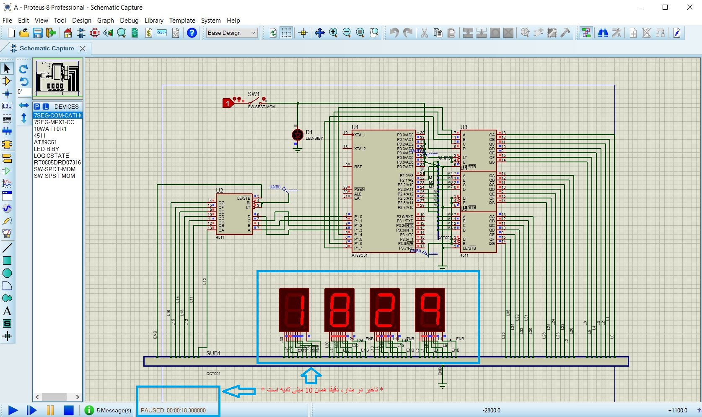
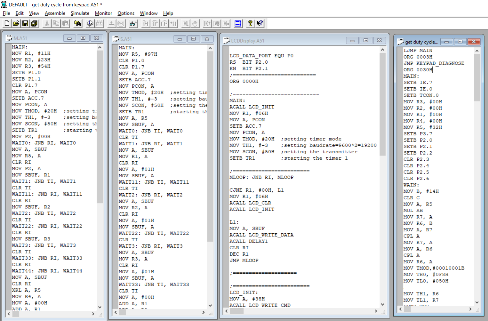
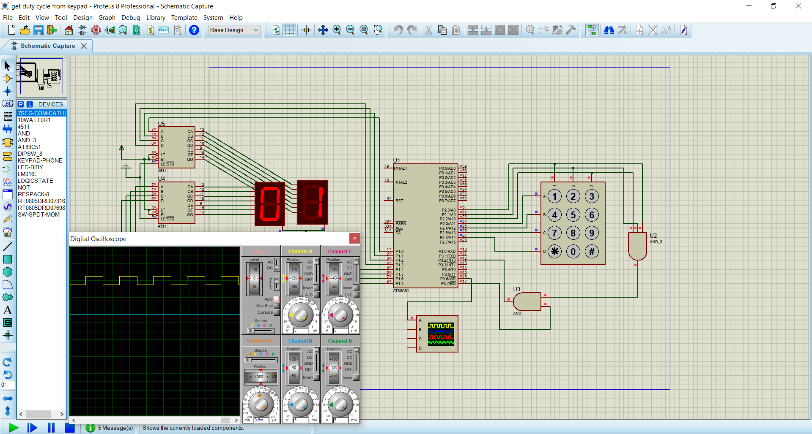

# Computer Architecture and Microprocessors Course Projects

In this course, I gained a deep understanding of CPU operations, starting from the early 8085 and 8051 microprocessors and EEPROMs to modern CPUs. I learned about interrupts, data transmission and reception using various protocols, LCD design, and how keyboards and SSDs function, among numerous other topics.

This course was fantastic, filled with intriguing materials, reading datasheets, circuit design, and assembly language programming.

Below are some of my circuits along with some examples of **assembly code**, provided in 8051 IDE.

