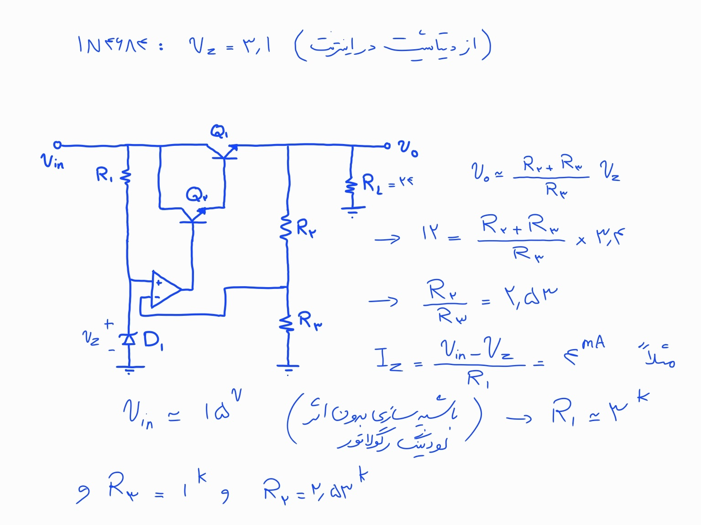
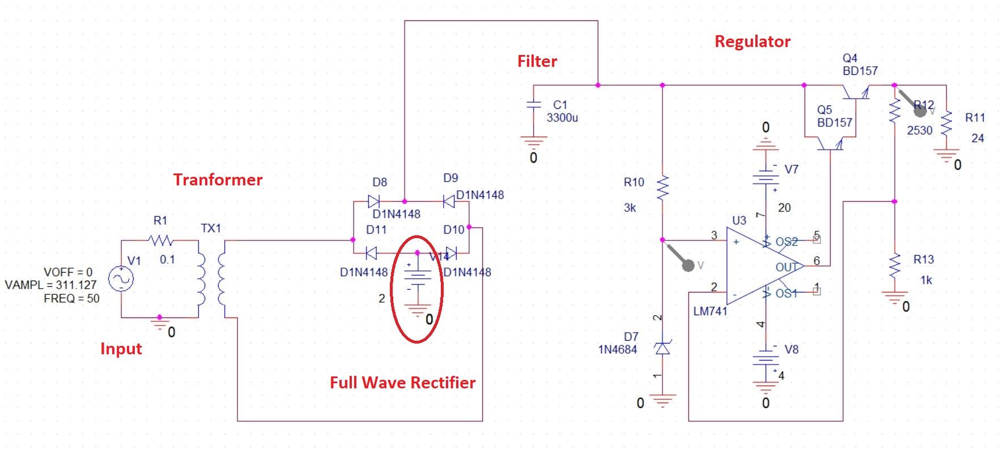
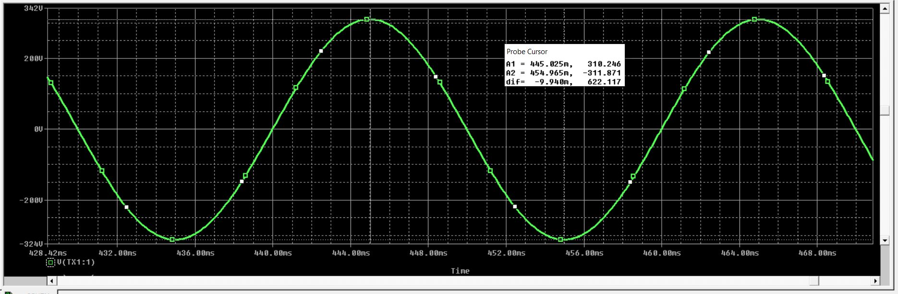
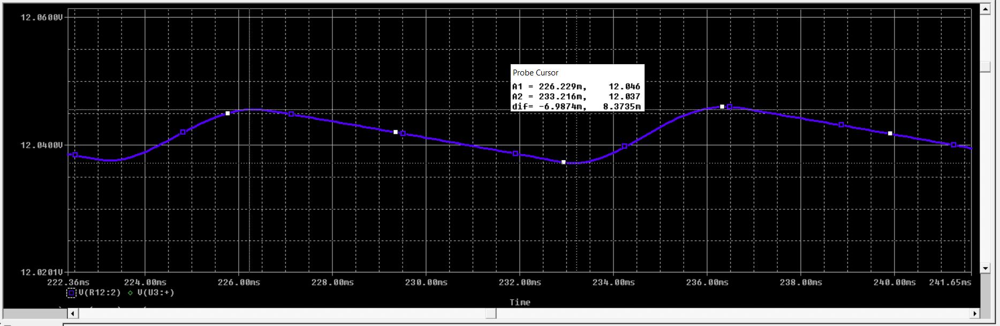

# Design And Simulation of a Voltage Regulator

In this course project, I was tasked with designing a voltage regulator on paper, calculating the value of each component in the circuit mathematically to match the project specifications, and then designing and simulating the circuit in PSPICE.

Below are my handwritten notes and the simulation results.

   

