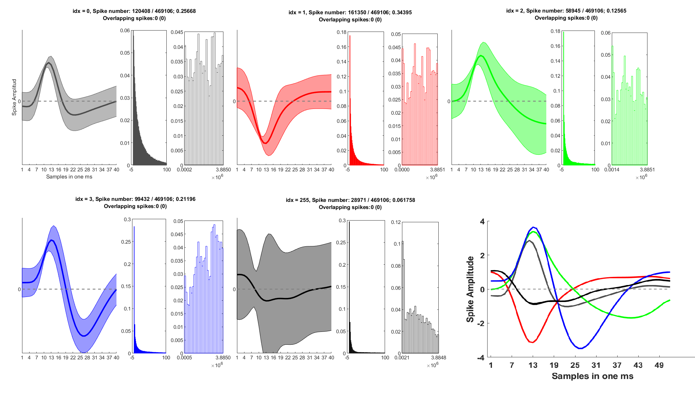
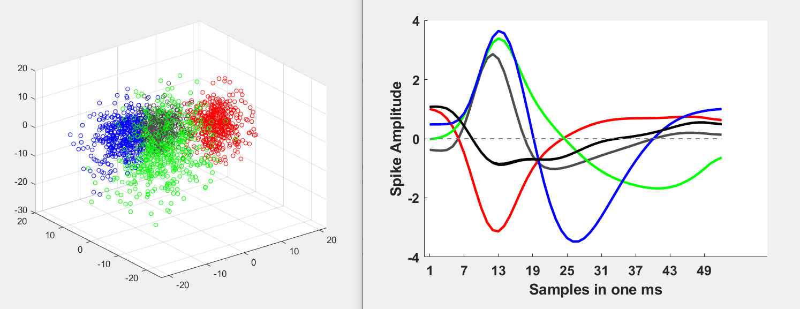
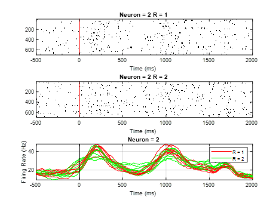
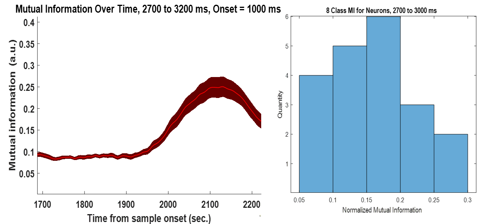
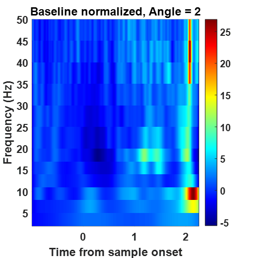

# IPM, Macaque Monkey Memmory-Guided Saccade Task

This project took nearly 4 months to complete. I began by preprocessing the neural data recorded from **macaque monkeys' frontal eye field during a memory-guided saccade task**. After implementing the **spike sorting** step in MATLAB, I proceeded with the analysis, starting with basic visualizations such as **raster plots and PSTHs**.

Next, I calculated several metrics, including **Mutual Information** and the **area under the ROC curve** for different periods. Using a simple SVM, I assessed the performance of decoding different angles in the FEF neurons. I also computed various other metrics, such as the **time-frequency map** of the LFPs using wavelet and multitaper methods, **phase-phase locking** between LFP pairs, and **spike-phase locking**.

Although this wasn't everything I did in the project, I gained a solid understanding of the fundamentals of neural data analysis.

