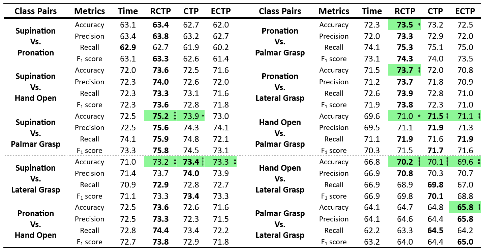
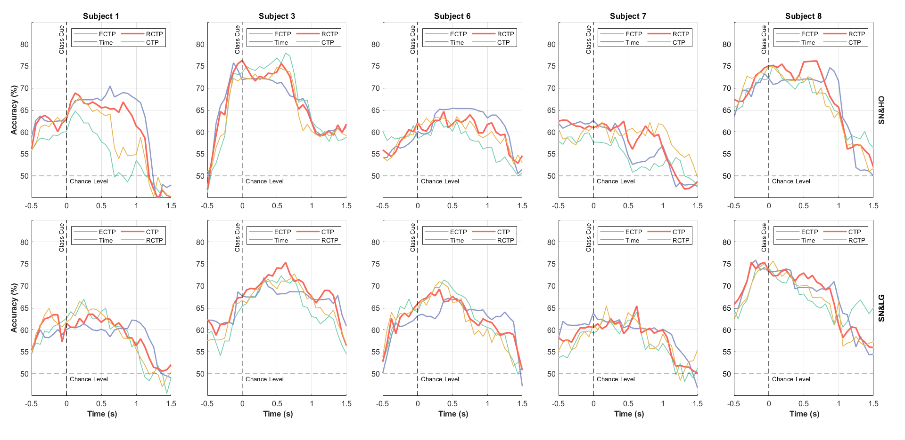
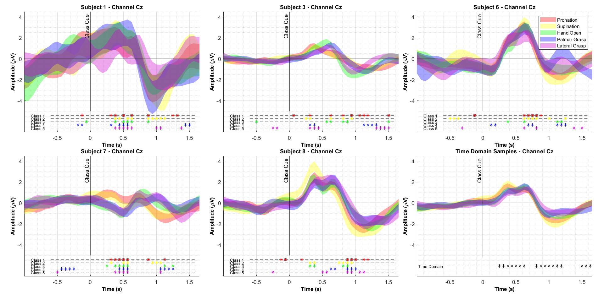
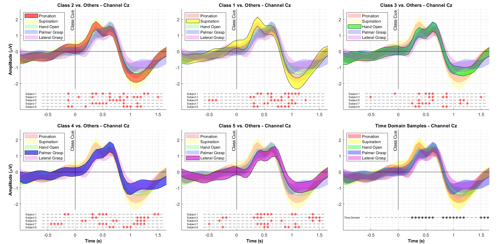

# Regularized Common Temporal Pattern

**This project will soon be published as a paper**. Initially, it was my bachelor's project. I began by replicating the results from the [Ofner et. al.](https://www.nature.com/articles/s41598-019-43594-9) paper. Then, with the guidance of **Dr. Sepideh Hajipour**, I developed a novel feature extraction method that can extract information from the time domain in EEG signals, **outperforming the traditional method**, which used raw time samples to classify motor imagery tasks. I also tested the performance of two other methods, CTP and ECTP, on this dataset. While a complete explanation of these algorithms is beyond the scope of this page, you can view some of our paper's figures and tables here.

Since this project was my first research experience, I learned the fundamentals of EEG signal processing through this work.

 

