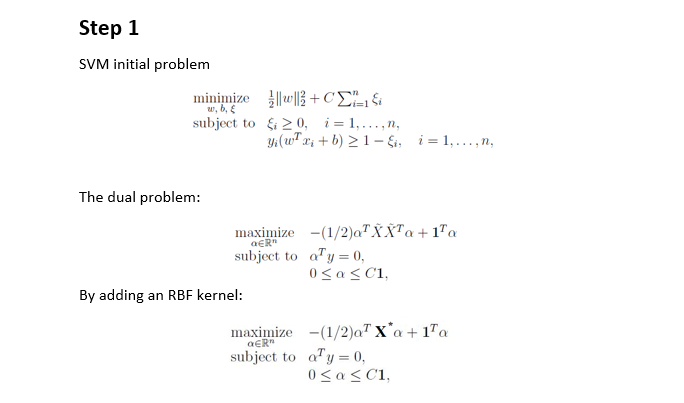
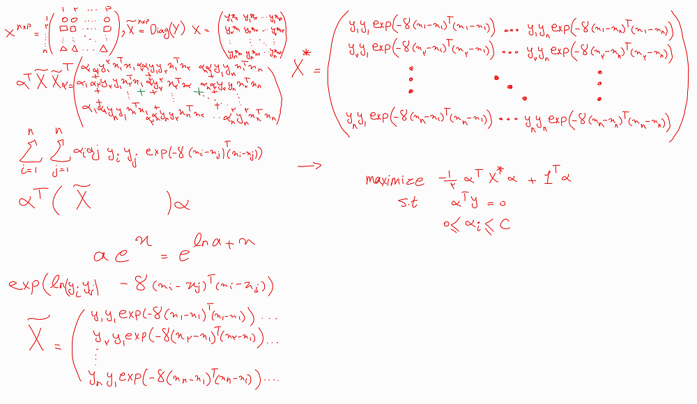
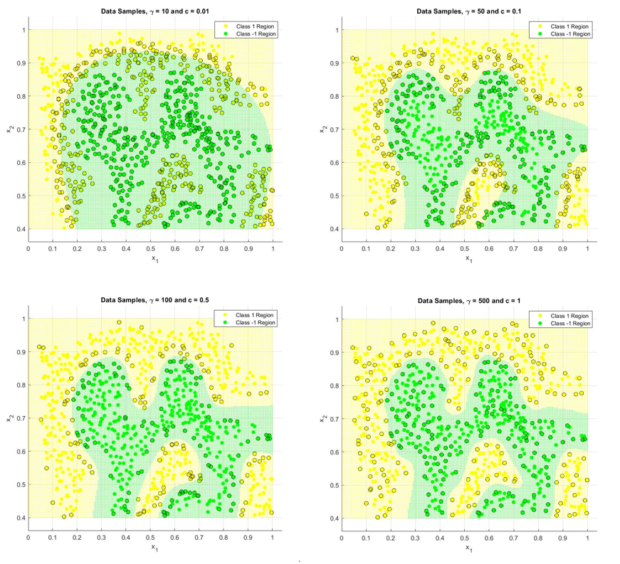

# Deriving the SVM Problem Mathematically and Testing it on a Dataset

In this course project, I was tasked with deriving the Support Vector Machine (SVM) optimization problem mathematically, finding its Lagrange dual, and adding a Radial Basis Function (RBF) kernel to the initial problem. I then solved it using a provided 2-dimensional dataset with CVX in MATLAB.

Below are sections of my report, an example of a handwritten note, and the final results.

