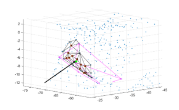
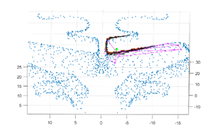
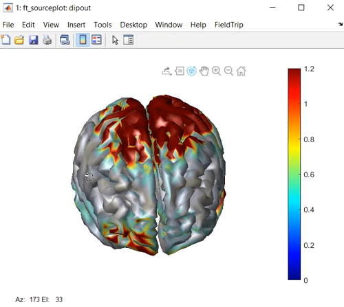
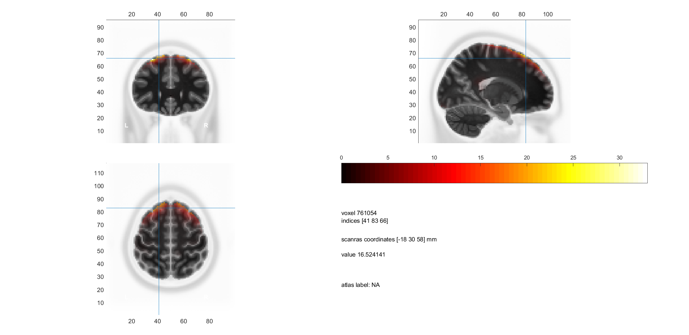

# Source Reconstruction Algorithms

I began my internship at the **University of Oslo** in July 2023, working under the supervision of **Dr. Bjorn Erik Juel** to develop a source reconstruction algorithm using the **eLORETA** method with **the NYC head model**. This project extended until March 2024 due to the challenges of integrating the NYC head model with the FieldTrip toolbox in MATLAB. Ultimately, I implemented an automatic MATLAB script that receives EEG signals as input, prompts for event details, and estimates the source activity. 

During this project, I successfully prepared an NYC head model format compatible with the FieldTrip toolbox for the first time. As a result, I collaborated with **Dr. Lucas C. Parra** on another source reconstruction project. Since their dataset contained only a single vector for source localization, conventional algorithms struggled to estimate the source activity accurately. Although my project concluded after several attempts to use single vectors for source localization, I gained extensive knowledge about working with MRI data and various source localization algorithms, such as **eLORETA**, **LAURA**, **WMNE**, **LCMV beamforming**, and **4-ExSo MUSIC**, by implementing most of them.

Additionally, I added an interesting feature to the visualization of the results. Since the results of source reconstruction are typically presented as static images and are not available across time, I implemented a slider in my scripts that allows users to view the results over time. A **video** demonstrating this feature can be found [here](https://github.com/MahdiBabaei78/EEG-Source-Reconstruction-NYC-Head-Model/blob/master/UI%20Video.mp4)..

