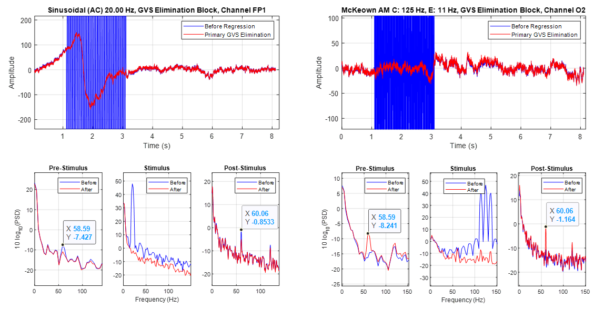

# Finding The Best GVS For PD Patients

This project will soon be published as a research paper. I joined the McKeown lab in April 2024, starting my role as an EEG expert. The lab was working on an important project aimed at finding the best type of electrical vestibular stimulation to improve behavioral metrics in Parkinsonian patients, such as motor vigor and response time. However, the project had stalled in the denoising phase. My supervisor, Dr. Sepideh Hajipour, and I developed a **semi-automatic denoising pipeline** to preprocess the EEG signals. After completing this, we extracted various biomarkers from the clean EEG signals while applying 304 different types of electrical stimuli. **We discovered that specific stimuli types improved PD biomarkers—a significant finding, demonstrating that brain signals can be modulated with non-invasive electrical stimulation**.

This project is AMAZING! I learned a great deal about Parkinson's disease, **weak supervision**, and various preprocessing algorithms such as **GEVD** and **DSS** during this work. Many of the challenges addressed in this project were being tackled for the first time, contributing to its outstanding result which was actually a breakthrough in the brain stimulation field of research.

 