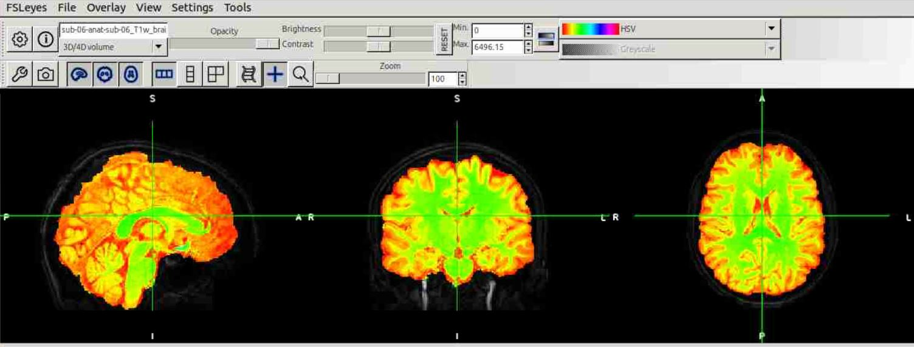
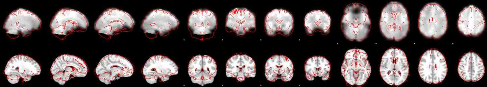
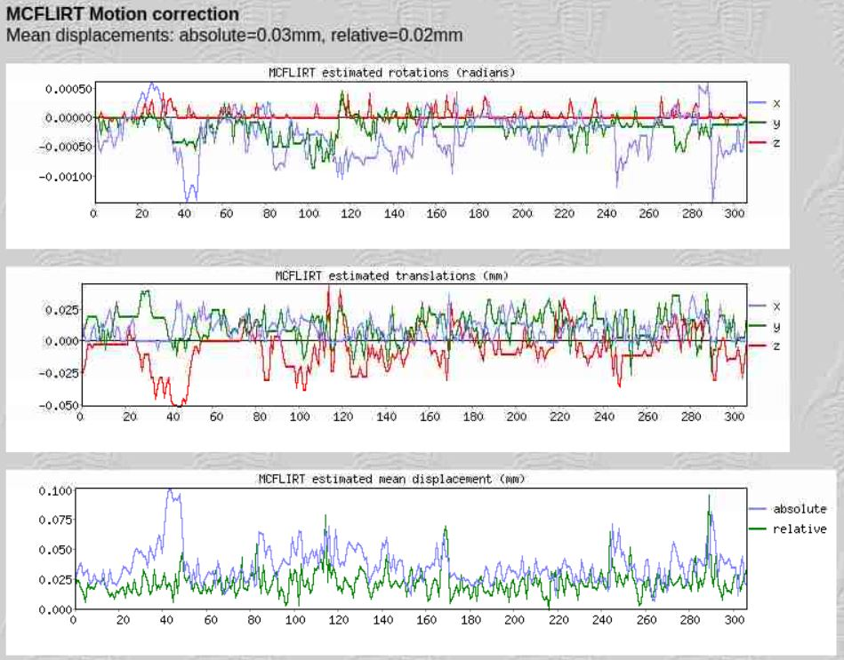
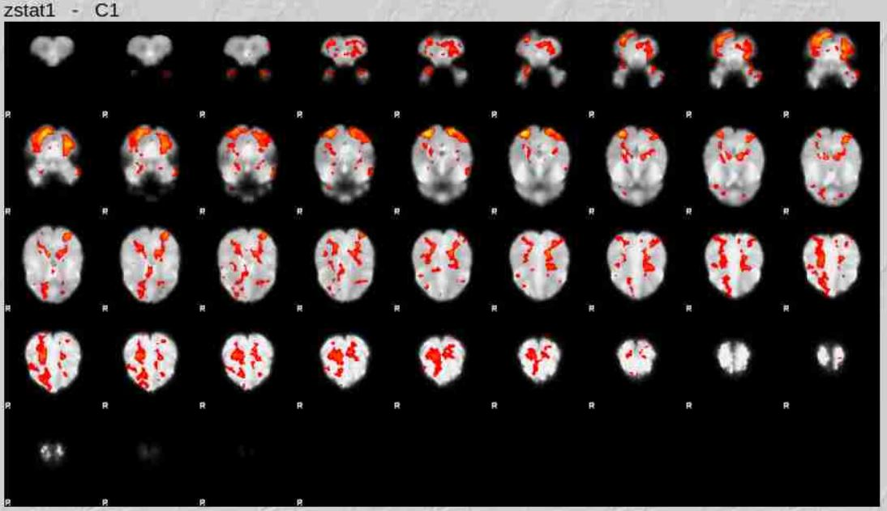
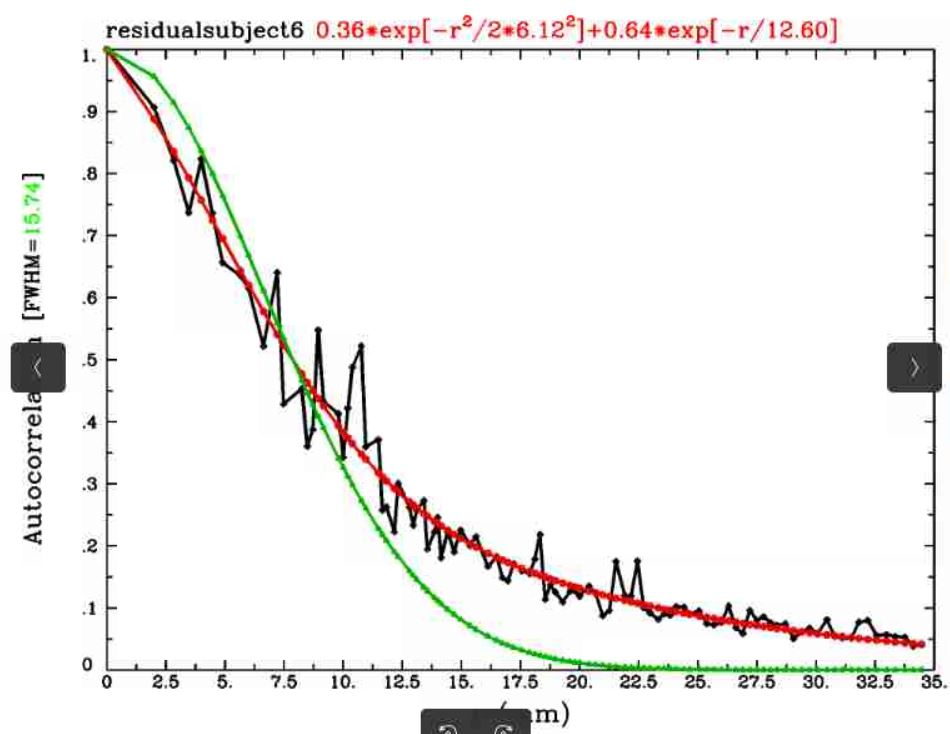
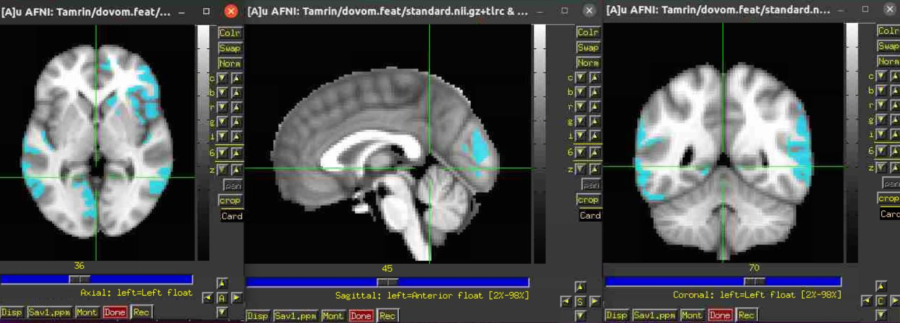

# fMRI, Course Project

In this project, we learned the basics of fMRI data analysis by working on the data of the ["Evidence Accumulation During Value-Based Decisions" paper](https://www.nature.com/articles/ncomms15808).

We used the **AFNI**, **SPM**, and **FSL** toolboxes in this project. The steps were as follows:

1. Extracted the **brain region** from anatomical MRI images using FSL-BET.
2. Created two **regressors**: one for the visual stimulus onset and another for the response time.
3. Performed **GLM analysis** for each subject using FSL-FEAT, with no spatial smoothing, utilizing the BBR algorithm.
4. Conducted GLM analysis on standardized functional images.
5. Calculated the spatial correlation parameters of fMRI noise using GLM residuals and a gray matter mask.
6. Applied **cluster correction** and visualization for different p-values using AFNI.

