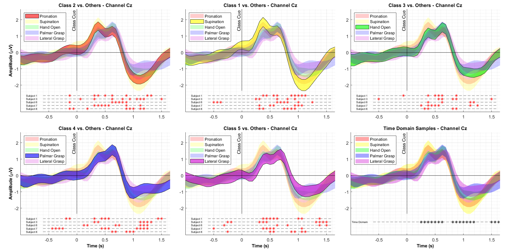
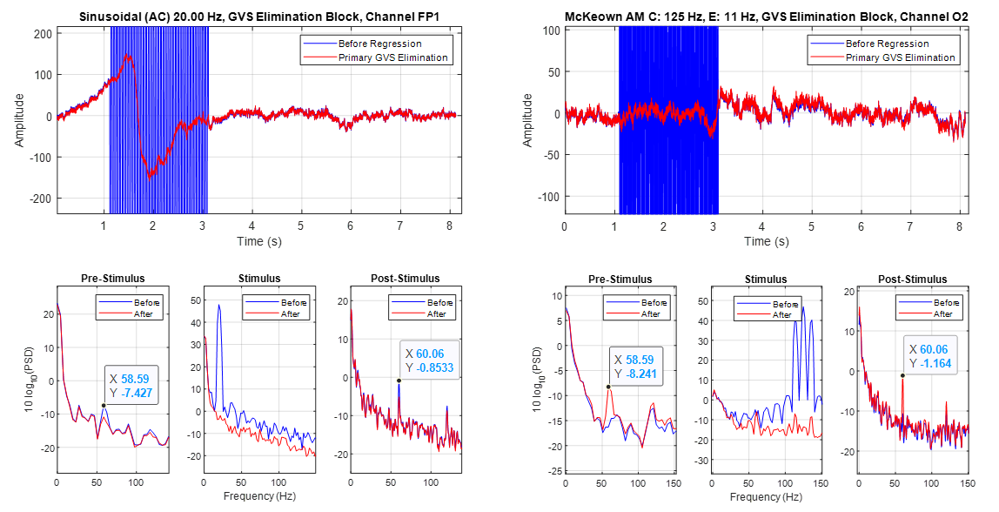
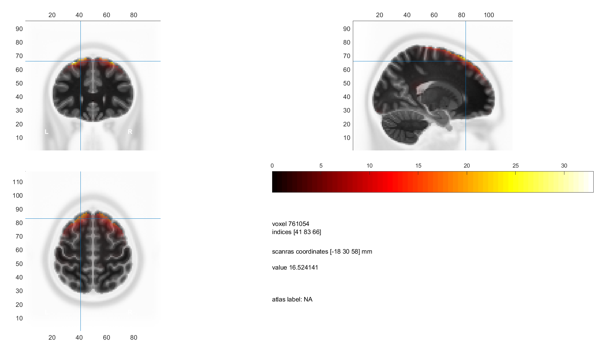

# Projects

On this page, a list of my projects is provided. You can click on any picture that interests you to be redirected to the specific project page.

## Regularized Common Temporal Pattern

## Finding The Best Stimuli For Parkinsonian Patients 

## Source Localization With eLORETA Utilizing The NYC Head Model 

