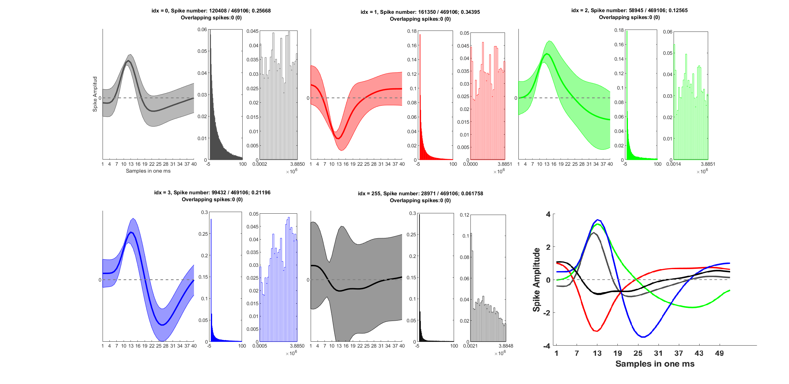
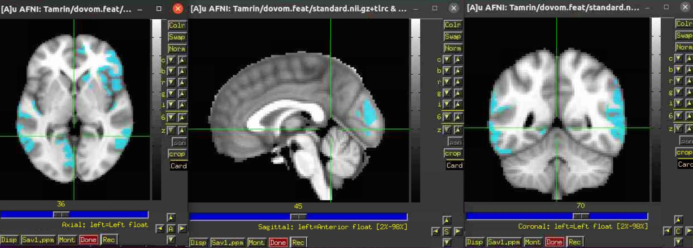
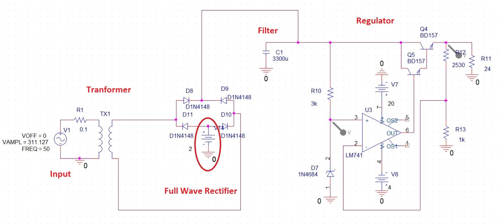
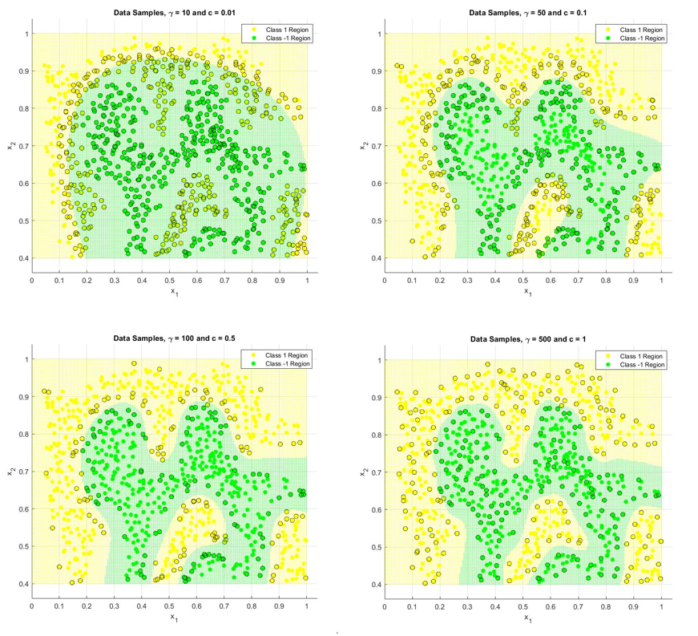
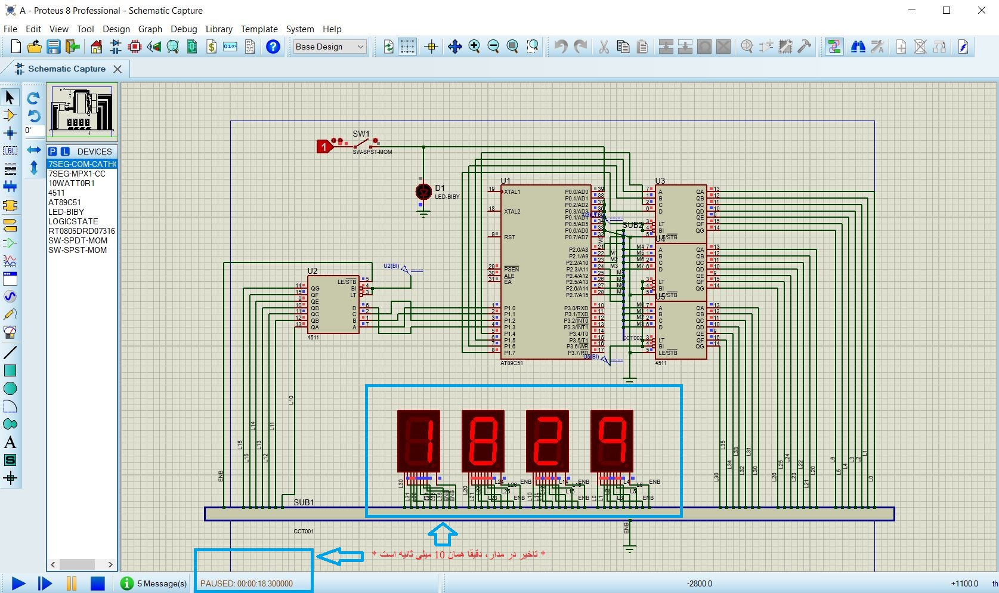

# Projects

On this page, a list of my projects is provided. You can **click on any picture** that interests you to be redirected to the specific project page.

## Regularized Common Temporal Pattern

## Finding The Best Stimuli For Parkinsonian Patients 

## Source Localization With eLORETA Utilizing The NYC Head Model 

## IPM, Macaque Monkey Memmory-Guided Saccade Task 

## fMRI, Evidence Accumulation During Value-Based Decisions 

## Voltage Regulator Design And Simulation 

## Deriving the SVM Problem Mathematically and Testing it

## Computer Architecture and Microprocessors Course Projects
